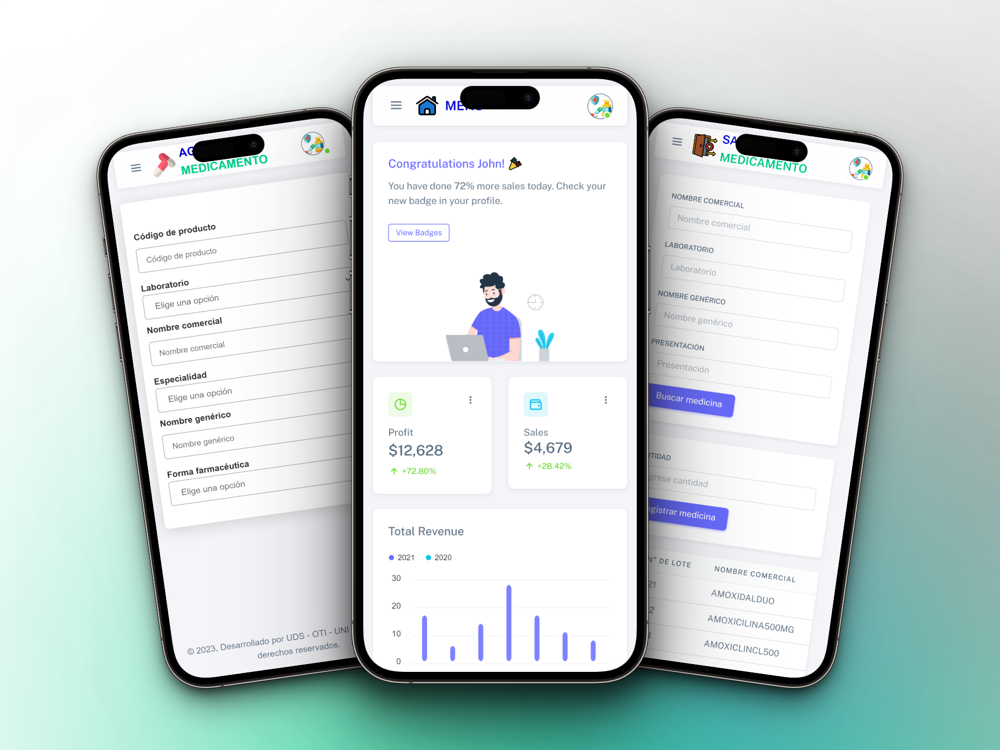

<div align="center">

  <br />

  <h2 align="center">🏥💊 Centro Médico - UNI 🚑👨‍⚕️</h2>

   Centro Médico - UNI, is a fully responsive website, <br />Responsive for all devices, created with PHP, CSS, JavaScript and Bootstrap. 

</div>

<br />

### Demo Screeshots



### Prerequisites

Before you begin, ensure you have met the following requirements:

* [Git](https://git-scm.com/downloads "Download Git") must be installed on your operating system.

### Run Locally

To run **Centro Médico - UNI** locally, run this command on your git bash:

Linux and macOS:

```bash
sudo git clone https://github.com/AnthonyAvellaneda10/centro-medico-uds.git
```

Windows:

```bash
git clone https://github.com/AnthonyAvellaneda10/centro-medico-uds.git
```